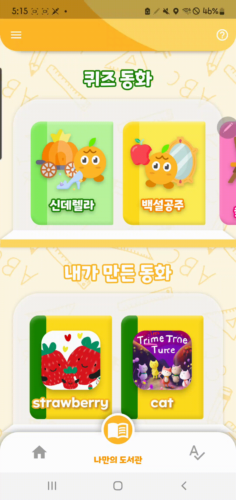
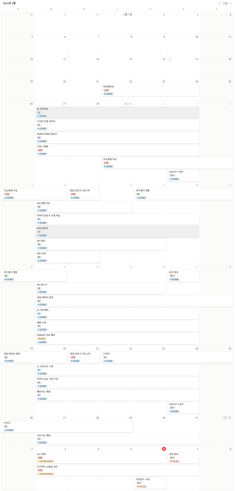
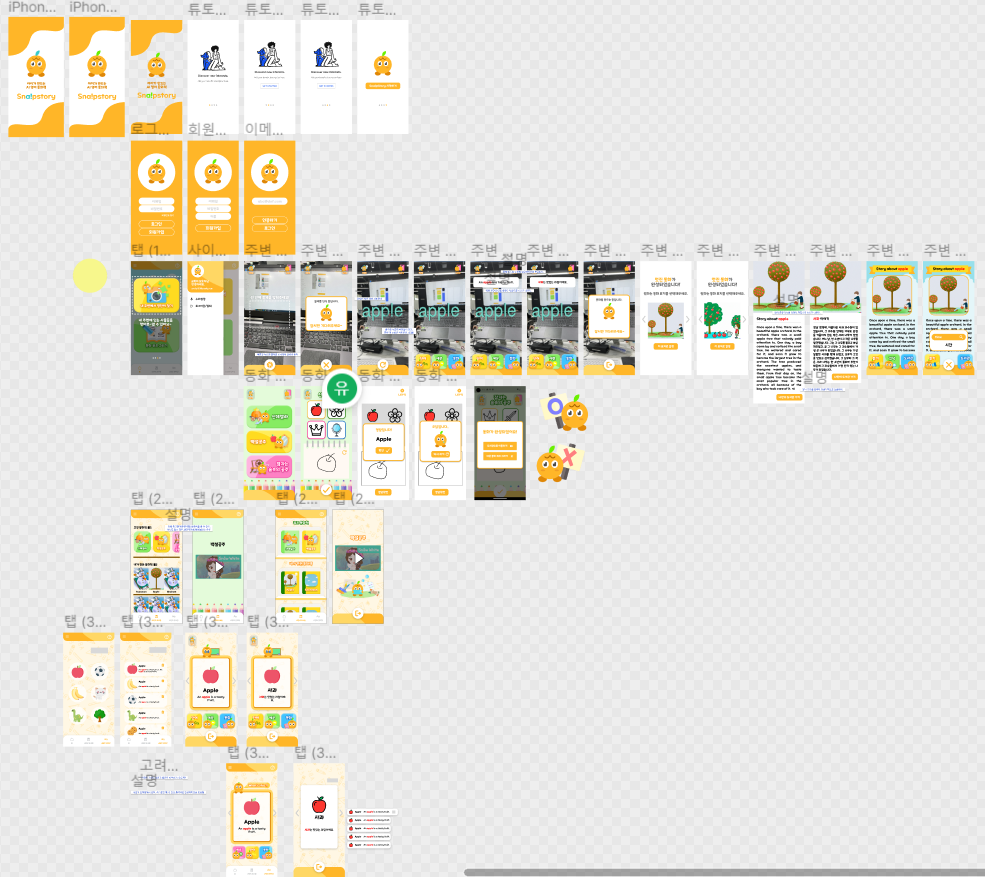
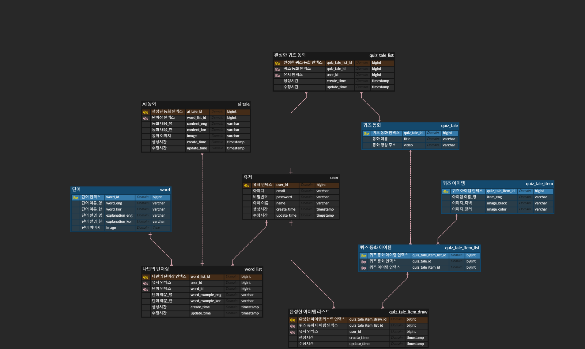
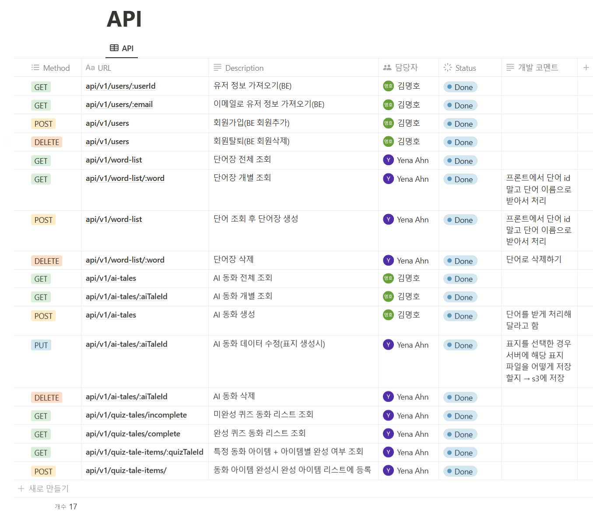

# 목차

0. **[apk 다운로드 하기](#apk 다운로드 하기)**
1. **[서비스 소개](#서비스-소개)**
2. **[기획 배경](#기획-배경)**
3. **[디자인 컨셉](#디자인-컨셉)**
4. **[시연 영상](#시연-영상)**
5. **[기술 스택](#기술-스택)**
6. **[프로젝트 일정 및 산출물](#프로젝트-일정-및-산출물)**
7. **[프로젝트 폴더 구조](#프로젝트-폴더-구조)**
8. **[개발 멤버](#개발-멤버)**


# 🚙 apk 다운로드 하기
https://j8a401.p.ssafy.io/

# 🚙 서비스 소개

[](https://www.youtube.com/watch?v=RDSZdaFqegk)


### 🔹 개요

- 한줄 소개 : AI기반 영어교육 모바일 애플리케이션
- 서비스명 : Sna!pstory

### 🔹 타겟

- 영어를 흥미롭게 접하고 싶은 아이
- 일상생활에서 영어를 자주 접하게 하고 그 과정에서 저비용, 고효율의 영어 교육을 원하는 부모님

# 🚙 기획 배경

### 🔹 배경

- 학부모들은 어렵고 딱딱한 텍스트 위주의 학습이 아니라, 놀이나 활동 중심의 자연스러운 영어를 어린 나이부터 즐겁게 체험하는 방식을 제공하고자 노력하고 있다.
- 다수의 참여자들이 자녀의 영어 스트레스, 학업 거부, 학습 부진 등으로 인한 실망과 회의감 및 양육 스트레스를 경험하고 있다.
- 현재의 유아 영어 교육의 과도한 교육비, 이중 지출, 고비용이면서 저효율인 가성비의 문제, 그럼에도 불구하고 고비용의 영어교육에 계속 투자할 수밖에 없는 현실 속에서 고민하고 갈등하는 부모님들이 많다.
- 일상생활에서 아이들이 영어를 더 자주 접하게 하고 싶은 부모님들이 많다. → 더 많은 언어를 접했으면 하는 니즈가 있음.

### 🔹 목적

- 아이들에게는
    - 실생활에서 자연스럽고 즐겁게 영어단어와 문장 학습 가능
    - 영어에 대한 흥미 유발 가능
- 학부모에게는
    - 자녀의 영어 교육 고민 완화
    - 고비용을 들이지 않고 영어 교육이 가능

### 🔹 의의

- 내 주변 사물을 직접 촬영해서 단어를 확인하는 과정을 통해 나의 주변에 있는 사물들을 영어로 친숙하게 받아들이게 하며 AR을 이용해 3D로 단어를 띄워 흥미를 유발한다. 영어에 대한 흥미로운 경험이 지속되게 하여 이후의 영어에 대한 경험들을 긍정적으로 받아들이도록 한다.
- 특정 동화에서 제시하는 그림을 퀴즈 형식으로 맞히는 경험을 통해 재미있게 단어를 익히게 하며, 사물을 완성하면 보상으로 동화를 재생해주어 성취감을 느끼게 한다.
- 영어 예문을 스스로 만들어서 듣고, 동화를 만들어서 읽어보고 들어보는 경험을 통해 정확한 영어 발음을 계속 접하게 되므로 원어민 선생님에게 영어를 배우도록 하기 위해 지출하던 많은 비용을 절약할 수 있다.

# 🚙 디자인 컨셉


# 🚙 시연 화면


### 🔹 회원가입


### 🔹 튜토리얼


### 🔹 홈 탭 - 내 주변 사물 영단어 찾기


### 🔹 홈 탭 - 퀴즈 동화 맞히기


### 🔹 나만의 도서관 탭


### 🔹 나만의 단어장 탭


### 🔹 중복 동화 확인


### 🔹 로그아웃



### 🔹 탈퇴


# 🚙 기술 스택

### [AI]

- Pytorch
- Tensorflow
- Anaconda
- FastAPI
- CLIP, CNN

### [FE]

- Flutter
- Firebase
- ARCore, ARKit
- Figma
- Visual Studio Code
- Android Studio
- Intellij

### [BE]

- Spring Boot
- Gradle(Kotlin)
- MySQL
- Spring Data JPA
- Spring Security
- JWT
- Jenkins
- Docker
- Docker Compose
- SSL
- NGINX
- AWS(EC2, S3)
- Intellij

### [ETC]

- Jira
- GitLab
- Notion
- Mattermost
- Webex

# 🚙 프로젝트 일정 및 산출물

## 프로젝트 일정



## 프로젝트 진행

### 1. Git flow

---

### 브랜치 전략

- master
    - 배포 가능한 상태의 결과물
- develop
    - 구현한 기능을 병합하기 위한 브랜치
    - 통합 폴더의 기능
- feature
    - 개별 기능 구현 브랜치
    - 기능 개발 완료 시 삭제
    - 네이밍 규칙
        - ex. fe/feature/`function`
        - ex. be/feature/`function`

### 커밋 컨벤션

- 구조
    - 태그와 제목으로 구성
        - `태그: 제목`

- 태그
    - 영어로 쓰되 첫 문자는 대문자로 작성
    - 종류
        - `Feat` : 새로운 기능 추가
        - `Fix` : 버그 수정
        - `Docs` : 문서 수정
        - `Design` : css 등 사용자 UI 디자인 변경
        - `Style` : 코드 포맷팅, 세미콜론 수정 등 코드가 아닌 형식 수정
        - `Refactor` : 코드 리팩토링
        - `Test` : 테스트 코드 추가 및 리팩토링 테스트 등
        - `Chore` : 빌드 업무 수정, 패키지 매니저 수정 등
        - `Init` : 프로젝트 신규 생성, 라이브러리 설치 등
        - `Rename` : 파일명을 수정하거나 옮기는 작업
        - `Remove` : 파일을 삭제하는 작업

- 제목
    - 최대 50글자
    - 한글로 작성하며, 영어로 시작하는 경우 대문자로 시작
    - 마침표 및 특수기호는 사용하지 않음

### 2. Jira

---

### Epic

- 큰 파트 생성
- 기획 / 화면설계 / DB / 개발 / 배포 / 테스트 / 학습
    - [ ]  개발 세분화 내용 반영

### Story

- 회원에게 제공되는 서비스/기능 목록
- 네이밍 규칙
    - 명사로 마무리
    - ex. 회원가입, 로그인, 게시물 작성
- Story Point는 0

### Task

- 해당 스토리에 관련한 상세 구현 사항
- 네이밍 규칙
    - 파트는 대괄호에 작성
    - 명사로 마무리
    - ex. [BE] 유저 모델 작성
- Story Point는 4 이하로 작성
- SubTask 작성 대신 확인 가능한 Task로 세분화하여 작성

## 프로젝트 산출물

### 1. Figma



### 2. ERD



### 3. API 문서

[SWAGGER](https://j8a401.p.ssafy.io/swagger-ui/index.html#/)

### 4. API 명세서



# 🚙 프로젝트 폴더 구조

## AI

```bash
+---clip
|   \---app
|       +---images
|       +---model
|       \---test
|           +---accuracy
|           \---data_ndjson
\---doodle-recognition-cnn
    +---app
    |   \---model
    \---local-test
        \---__pycache__
```

## BE

```bash
+---.gradle
|   +---7.6.1
|   |   +---checksums
|   |   +---dependencies-accessors
|   |   +---executionHistory
|   |   +---fileChanges
|   |   +---fileHashes
|   |   \---vcsMetadata
|   +---buildOutputCleanup
|   \---vcs-1
+---.idea
+---gradle
|   \---wrapper
\---src
    +---main
    |   +---java
    |   |   \---com
    |   |       \---ssafy
    |   |           \---snapstory
    |   |               +---config
    |   |               +---controller
    |   |               +---domain
    |   |               |   +---aiTale
    |   |               |   |   \---dto
    |   |               |   +---quizTale
    |   |               |   +---quizTaleItem
    |   |               |   +---quizTaleItemDraw
    |   |               |   |   \---dto
    |   |               |   +---quizTaleItemList
    |   |               |   |   \---dto
    |   |               |   +---quizTaleList
    |   |               |   |   \---dto
    |   |               |   +---user
    |   |               |   |   \---dto
    |   |               |   +---word
    |   |               |   \---wordList
    |   |               |       \---dto
    |   |               +---exception
    |   |               |   +---bad_request
    |   |               |   +---conflict
    |   |               |   +---forbidden
    |   |               |   +---internal_server_error
    |   |               |   +---not_found
    |   |               |   +---request_timeout
    |   |               |   \---unauthorized
    |   |               +---repository
    |   |               \---service
    |   \---resources
    |       \---static
    |           \---index_files
    \---test
        \---java
            \---com
                \---ssafy
                    \---snapstory
```

# 🚙 개발 멤버

## [AI]
- 김현호 : AI 모델 학습 및 배포, 데이터전처리
## [FE]
- 유지원 : FE, UI/UX
- 조은비 : FE, UI/UX
- 권택윤 : FE, Auth
## [BE]
- 안예나 : BE, REST API, DB, 디자인
- 김명호 : 팀장, BE, CI/CD, DB, FE(AR)
